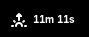

# Movement Break Reminder

A GNOME Shell extension that gently reminds you to take movement breaks and stay healthy throughout your workday. Features a countdown timer in your panel and customizable reminder intervals.


## Features

- 🏃 **Automatic Reminders** - Get gentle notifications to move, stretch, or exercise
- ⏰ **Live Countdown Timer** - See exactly when your next break is due right in the panel  
- ⚙️ **Customizable Intervals** - Set reminder frequency from 1 to 240 minutes
- 🎮 **Simple Controls** - Easy pause/resume functionality via panel menu
- 🎨 **Clean Interface** - Minimal design that doesn't clutter your workspace
- 🚀 **Auto-Start** - Begins working immediately when you log in

## Installation

### From GNOME Extensions Website (Recommended)
1. Visit [extensions.gnome.org](https://extensions.gnome.org/)
2. Search for "Break Reminder"
3. Click the toggle to install and enable

### Manual Installation
1. Download the latest release from [GitHub Releases](https://github.com/trishabala/break-reminder-extension/releases)
2. Extract the ZIP file to `~/.local/share/gnome-shell/extensions/`
3. Restart GNOME Shell (`Alt+F2`, type `r`, press Enter)
4. Enable the extension:
   ```bash
   gnome-extensions enable break-reminder@trishabala.github.com
   ```

### From Source
```bash
git clone https://github.com/trishabala/break-reminder-extension.git
cd break-reminder-extension
cp -r break-reminder@trishabala.github.com ~/.local/share/gnome-shell/extensions/
gnome-extensions enable break-reminder@trishabala.github.com
```

## Usage

### Getting Started
The extension starts automatically when enabled - no setup required! You'll see a timer in your top panel showing when your next movement break is due.

### Panel Controls
- **Timer Display**: Shows countdown to next break (e.g., "12m", "45s")
- **Click Panel Icon**: Opens quick menu with pause/resume controls
- **Alarm Icon**: Indicates when reminders are active

### Menu Options
- **Pause/Start Reminders**: Toggle break notifications on/off
- **Settings**: Configure reminder interval and other preferences

### Notifications
When it's time for a break, you'll receive a friendly notification with suggestions like:
- Stretch your muscles
- Take a short walk
- Do some quick exercises
- Look away from your screen

## Configuration

Access settings through:
1. Click the extension icon in the panel
2. Select "Settings" from the menu
3. Adjust the reminder interval (1-240 minutes)

### Available Settings
- **Movement Break Interval**: How often you want to be reminded (default: 15 minutes)

## Compatibility

- **GNOME Shell**: 45, 46, 47, 48+
- **Tested on**: Ubuntu 22.04+, Fedora 38+, Arch Linux
- **Architecture**: x86_64, ARM64

## Screenshots

| Panel View | Settings | Notification |
|------------|----------|--------------|
|  |  |  |

## Health Benefits

Regular movement breaks can help:
- 💪 Reduce muscle tension and strain
- 👀 Prevent eye strain from screen time  
- 🧠 Improve focus and productivity
- ❤️ Support cardiovascular health
- 🦴 Maintain better posture
- 😌 Reduce stress and mental fatigue

## Development

### Building from Source
```bash
# Clone the repository
git clone https://github.com/trishabala/break-reminder-extension.git
cd break-reminder-extension

# Install to local extensions directory
make install

# Enable the extension
make enable

# View logs for debugging
make logs
```

### Project Structure
```
break-reminder@trishabal.github.com/
├── extension.js          # Main extension logic
├── prefs.js             # Settings/preferences UI
├── metadata.json        # Extension metadata
├── stylesheet.css       # Custom styling
└── schemas/
    └── org.gnome.shell.extensions.breakreminder.gschema.xml
```

### Contributing
Contributions are welcome! Please:

1. Fork the repository
2. Create a feature branch (`git checkout -b feature/amazing-feature`)
3. Commit your changes (`git commit -m 'Add amazing feature'`)
4. Push to the branch (`git push origin feature/amazing-feature`)
5. Open a Pull Request

### Development Setup
```bash
# Install development dependencies
npm install

# Run linting
npm run lint

# Run tests
npm test

# Package for distribution
npm run package
```

## Troubleshooting

### Extension Not Showing
```bash
# Check if extension is enabled
gnome-extensions list --enabled

# Restart GNOME Shell
killall -3 gnome-shell
```

### Timer Not Updating
- Ensure the extension is not paused
- Check system notifications are enabled
- Try disabling and re-enabling the extension

### Settings Not Saving
```bash
# Reset settings to defaults
gsettings reset-recursively org.gnome.shell.extensions.breakreminder
```

### Logs and Debugging
```bash
# View extension logs
journalctl -f -o cat /usr/bin/gnome-shell

# Or use looking glass (Alt+F2, type 'lg')
```

## FAQ

**Q: Can I customize the notification message?**  
A: Currently, the notification text is fixed, but customization is planned for future versions.

**Q: Does this work with other desktop environments?**  
A: No, this is specifically designed for GNOME Shell. For other DEs, check out similar tools like Stretchly or Workrave.

**Q: Can I set different intervals for different times of day?**  
A: Not yet, but this feature is on the roadmap for v2.0.

**Q: Does the extension collect any data?**  
A: No, the extension runs entirely locally and doesn't collect or transmit any personal data.

## Changelog

### v1.0.0 (2025-06-20)
- Initial release
- Basic countdown timer functionality
- Customizable reminder intervals
- Auto-start on login
- Clean panel integration

## Roadmap

- [ ] Custom notification messages
- [ ] Multiple reminder profiles
- [ ] Break activity suggestions
- [ ] Statistics and tracking
- [ ] Integration with fitness apps
- [ ] Pomodoro technique support

## License

This project is licensed under the GPL v3 License - see the [LICENSE](LICENSE) file for details.

## Support

- 🐛 **Bug Reports**: [GitHub Issues](https://github.com/trishabala/break-reminder-extension/issues)
- 💡 **Feature Requests**: [GitHub Discussions](https://github.com/trishabala/break-reminder-extension/discussions)
- 📧 **Email**: trisha4bala@gmail.com

## Acknowledgments

- Thanks to the GNOME Shell development team
- Inspired by tools like Stretchly and RSIBreak
- Icons from GNOME's Adwaita icon theme
- Health tips from ergonomics research

---

**Stay healthy, stay productive!** 🏃‍♀️💪
